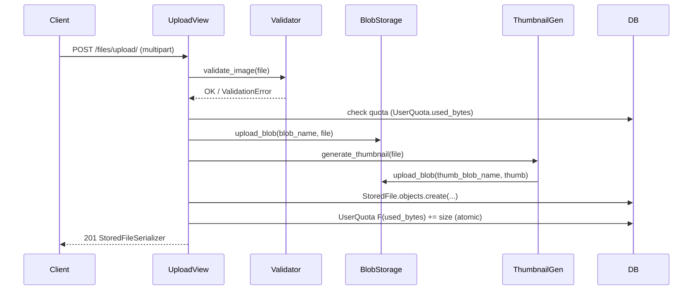
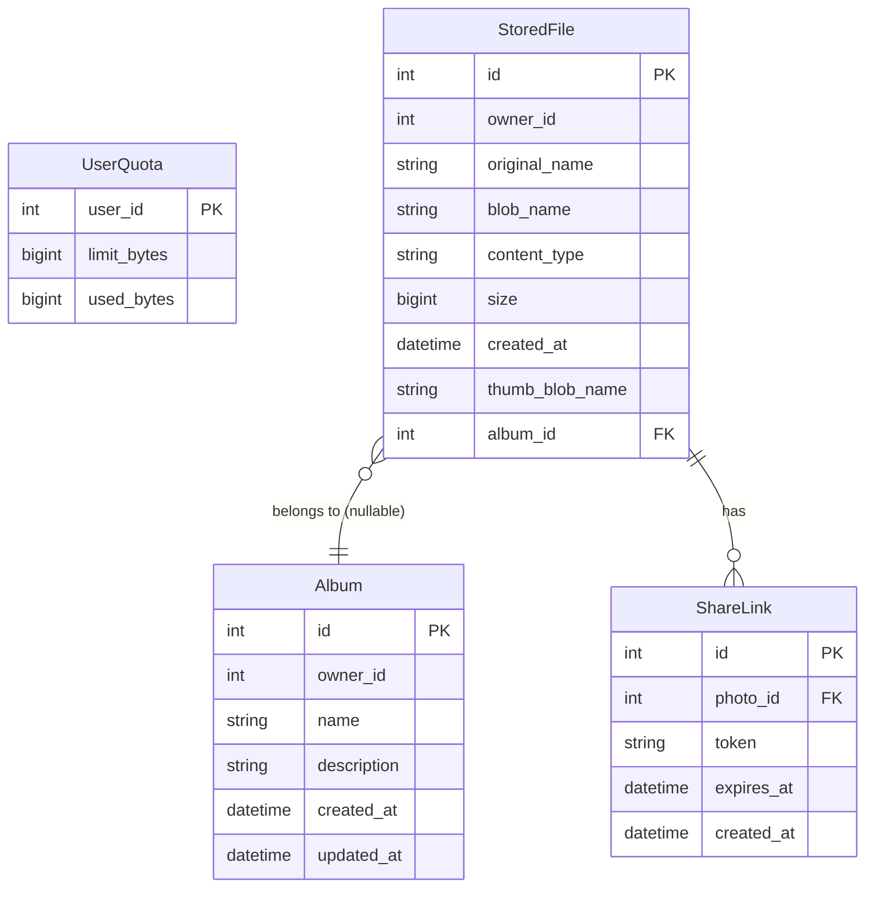

# Design Document – Photo Management Upgrade (file-service)

## Overview

Tài liệu này mô tả thiết kế kỹ thuật để nâng cấp `file-service` (Django REST Framework) thành hệ thống quản lý ảnh chuyên dụng. Phạm vi giới hạn hoàn toàn trong `file-service`; không thay đổi `auth-service`, `frontend-nextjs`, hay bất kỳ service nào khác.

Hệ thống hiện tại đã có: upload, download, delete, list file; quota management (`UserQuota`); lưu trữ qua Azure Blob Storage hoặc local filesystem.

Bản nâng cấp bổ sung 9 tính năng:
1. Validate định dạng ảnh (MIME + extension whitelist)
2. Thumbnail tự động (Pillow, ≤ 400 px)
3. Album CRUD
4. Search / filter / pagination
5. Rename ảnh
6. Share Link (public access, không cần JWT)
7. Streaming download
8. Quota optimization (cached `used_bytes`, atomic F() update)
9. Thumbnail endpoint

---

## Architecture

```
file-service/
├── file_service/          # Django project settings & urls
├── files/                 # Django app (toàn bộ logic ảnh)
│   ├── models.py          # StoredFile (mở rộng), UserQuota (mở rộng), Album, ShareLink
│   ├── serializers.py     # StoredFile, Album, ShareLink serializers
│   ├── views.py           # Tất cả API views (function-based hoặc class-based)
│   ├── urls.py            # URL routing
│   ├── validators.py      # NEW – image MIME/extension validation
│   ├── thumbnail.py       # NEW – Pillow thumbnail generation
│   ├── blob_storage.py    # Mở rộng thêm open_blob_stream()
│   ├── permissions.py     # NEW – IsOwnerOrShareLink permission helper
│   └── migrations/
│       ├── 0001_initial.py
│       └── 0002_photo_upgrade.py   # NEW
```

### Dependency mới cần thêm vào `requirements.txt`

```
Pillow==10.4.0
```

### Luồng xử lý Upload ảnh (sau upgrade)



---

## Components and Interfaces

### `files/validators.py`

```python
ALLOWED_MIME_TYPES = {
    "image/jpeg", "image/png", "image/gif",
    "image/webp", "image/bmp", "image/tiff", "image/svg+xml",
}

MIME_TO_EXTENSIONS = {
    "image/jpeg":   {".jpg", ".jpeg"},
    "image/png":    {".png"},
    "image/gif":    {".gif"},
    "image/webp":   {".webp"},
    "image/bmp":    {".bmp"},
    "image/tiff":   {".tiff", ".tif"},
    "image/svg+xml": {".svg"},
}

def validate_image_file(uploaded_file) -> None:
    """Raises ValidationError on invalid MIME, extension, or mismatch."""
```

Logic:
1. Lấy `content_type` từ `uploaded_file.content_type`.
2. Nếu không trong `ALLOWED_MIME_TYPES` → raise `ValidationError("Unsupported image type.")`.
3. Lấy extension từ `uploaded_file.name.lower()` (dùng `pathlib.Path(...).suffix`).
4. Nếu extension không trong union của tất cả allowed extensions → raise `ValidationError("Unsupported file extension.")`.
5. Nếu extension không thuộc `MIME_TO_EXTENSIONS[mime_type]` → raise `ValidationError("MIME type and extension mismatch.")`.

### `files/thumbnail.py`

```python
def generate_thumbnail(file_obj, max_edge: int = 400) -> tuple[bytes, str]:
    """
    Returns (thumbnail_bytes, mime_type).
    Raises ThumbnailError on failure.
    """

def derive_thumb_blob_name(blob_name: str) -> str:
    """
    "user/uuid-photo.jpg" -> "user/uuid-photo_thumb.jpg"
    Inserts '_thumb' before the last '.' in blob_name.
    If no extension: appends '_thumb'.
    """
```

Logic `generate_thumbnail`:
1. `file_obj.seek(0)`
2. `img = Image.open(file_obj)` trong `try/except Exception`.
3. `img.thumbnail((max_edge, max_edge), Image.LANCZOS)` – Pillow giữ aspect ratio tự động.
4. Save vào `BytesIO` với format giữ nguyên (JPEG → JPEG, PNG → PNG, v.v.).
5. Trả về `(buffer.getvalue(), mime_type)`.
6. Nếu exception → raise `ThumbnailError`.

### `files/blob_storage.py` (mở rộng)

Thêm hàm `open_blob_stream(blob_name: str)` trả về một **iterable/generator** thay vì load toàn bộ vào RAM:

```python
def open_blob_stream(blob_name: str):
    """
    Returns an iterable of bytes chunks (chunk_size=8192).
    - Azure: dùng BlobClient.download_blob().chunks()
    - Local: dùng open() + iter(lambda: f.read(8192), b"")
    """
```

Hàm `open_blob` hiện tại giữ nguyên (dùng nội bộ, không thay đổi signature).

### `files/permissions.py`

```python
class IsPhotoOwner:
    """Returns True if request.user.id == photo.owner_id."""

def get_photo_or_403(user_id, photo_id) -> StoredFile:
    """Returns photo or raises Http403/Http404."""

def resolve_share_link(token: str) -> ShareLink | None:
    """Returns active ShareLink or None. Checks expiry."""
```

### `files/views.py` – Các view mới / sửa đổi

| View function / class | Method | Endpoint | Ghi chú |
|---|---|---|---|
| `upload_file` | POST | `/files/upload/` | Thêm validation, thumbnail, atomic quota |
| `list_files` | GET | `/files/` | Thêm search/filter/pagination |
| `download_file` | GET | `/files/<id>/download/` | Chuyển sang streaming |
| `delete_file` | DELETE | `/files/<id>/` | Thêm delete thumbnail, atomic quota decrement |
| `rename_file` | PATCH | `/files/<id>/rename/` | NEW |
| `thumbnail_file` | GET | `/files/<id>/thumbnail/` | NEW |
| `quota` | GET | `/quota/` | Đọc `used_bytes` từ cache |
| `AlbumListCreateView` | GET, POST | `/albums/` | NEW |
| `AlbumDetailView` | GET, PUT/PATCH, DELETE | `/albums/<id>/` | NEW |
| `ShareLinkListCreateView` | GET, POST | `/files/<id>/share/` | NEW |
| `ShareLinkDetailView` | DELETE | `/share/<link_id>/` | NEW |
| `public_share_access` | GET | `/public/<token>/` | NEW – AllowAny |
| `public_thumbnail_access` | GET | `/public/<token>/thumbnail/` | NEW – AllowAny |

### `files/serializers.py`

```python
class StoredFileSerializer(ModelSerializer):
    # Fields thêm: thumb_blob_name, album_id

class AlbumSerializer(ModelSerializer):
    photo_count = SerializerMethodField()
    # Fields: id, owner_id, name, description, created_at, photo_count

class ShareLinkSerializer(ModelSerializer):
    share_url = SerializerMethodField()
    # Fields: id, photo_id, token, expires_at, created_at, share_url
```

---

## Data Models

### Thay đổi `StoredFile`

```python
class StoredFile(models.Model):
    owner_id       = models.PositiveIntegerField(db_index=True)
    original_name  = models.CharField(max_length=255)
    blob_name      = models.CharField(max_length=512, unique=True)
    content_type   = models.CharField(max_length=120, blank=True)
    size           = models.BigIntegerField()
    created_at     = models.DateTimeField(auto_now_add=True)
    # NEW:
    thumb_blob_name = models.CharField(max_length=512, blank=True, null=True)
    album           = models.ForeignKey(
        "Album", null=True, blank=True,
        on_delete=models.SET_NULL, related_name="photos"
    )

    class Meta:
        ordering = ["-created_at"]
        indexes = [
            models.Index(fields=["owner_id", "created_at"]),
            models.Index(fields=["owner_id", "album"]),
        ]
```

### Thay đổi `UserQuota`

```python
class UserQuota(models.Model):
    user_id     = models.PositiveIntegerField(unique=True)
    limit_bytes = models.BigIntegerField(default=settings.DEFAULT_USER_QUOTA_BYTES)
    # NEW:
    used_bytes  = models.BigIntegerField(default=0)
```

### Model mới `Album`

```python
class Album(models.Model):
    owner_id    = models.PositiveIntegerField(db_index=True)
    name        = models.CharField(max_length=100)
    description = models.TextField(blank=True, default="")
    created_at  = models.DateTimeField(auto_now_add=True)
    updated_at  = models.DateTimeField(auto_now=True)

    class Meta:
        ordering = ["-created_at"]
        indexes = [models.Index(fields=["owner_id"])]
```

### Model mới `ShareLink`

```python
import secrets

class ShareLink(models.Model):
    photo      = models.ForeignKey(StoredFile, on_delete=models.CASCADE, related_name="share_links")
    token      = models.CharField(max_length=128, unique=True, db_index=True)
    expires_at = models.DateTimeField(null=True, blank=True)
    created_at = models.DateTimeField(auto_now_add=True)

    class Meta:
        indexes = [models.Index(fields=["token"])]

    @classmethod
    def generate_token(cls) -> str:
        return secrets.token_urlsafe(32)  # 32 bytes entropy -> 43 URL-safe chars

    def is_expired(self) -> bool:
        if self.expires_at is None:
            return False
        from django.utils import timezone
        return timezone.now() > self.expires_at
```

### Sơ đồ quan hệ



---

## API Endpoints

### Endpoint đã có – thay đổi

#### `POST /files/upload/`
**Request**: `multipart/form-data` với field `file` + optional `album_id` (int)

**Response 201**:
```json
{
  "id": 42,
  "owner_id": 7,
  "original_name": "sunset.jpg",
  "blob_name": "7/uuid-sunset.jpg",
  "content_type": "image/jpeg",
  "size": 204800,
  "created_at": "2025-01-15T10:00:00Z",
  "thumb_blob_name": "7/uuid-sunset_thumb.jpg",
  "album_id": 3
}
```

**Thay đổi so với hiện tại**:
- Thêm `validate_image_file(uploaded)` trước khi upload.
- Sau upload: gọi `generate_thumbnail`, upload thumb, lưu `thumb_blob_name`.
- Quota check dùng `quota.used_bytes` thay vì `SUM(size)`.
- Sau tạo record: `UserQuota.objects.filter(user_id=...).update(used_bytes=F("used_bytes") + size)`.

**Error 400**:
```json
{"detail": "Unsupported image type. Allowed: image/jpeg, image/png, ..."}
```

#### `GET /files/`
**Query params**: `search`, `album_id`, `date_from`, `date_to`, `page`, `page_size`

**Response 200**:
```json
{
  "count": 150,
  "next": "http://host/files/?page=2&page_size=20",
  "previous": null,
  "results": [...]
}
```

#### `GET /files/<id>/download/`
**Thay đổi**: dùng `open_blob_stream()` thay vì `open_blob()`. Trả `StreamingHttpResponse` với `content_type` và `Content-Disposition: attachment`.

#### `DELETE /files/<id>/`
**Thay đổi**: trước khi xoá, nếu `item.thumb_blob_name` tồn tại → `delete_blob(item.thumb_blob_name)`. Sau xoá: `UserQuota ... update(used_bytes=F("used_bytes") - size)`.

---

### Endpoint mới

#### `PATCH /files/<id>/rename/`
**Auth**: JWT required, phải là owner.

**Request body**:
```json
{"name": "new photo name"}
```

**Logic**:
- Validate `1 <= len(name) <= 255`.
- Tách extension từ `item.original_name` hiện tại: `ext = Path(item.original_name).suffix`.
- Tách base mới: `new_base = Path(name).stem` (bỏ extension nếu user gửi kèm).
- Set `item.original_name = new_base + ext`.
- Save.

**Response 200**: `StoredFileSerializer`.

---

#### `GET /files/<id>/thumbnail/`
**Auth**: JWT required (owner) hoặc `?token=<share_token>`.

**Logic**:
- Nếu không có JWT: kiểm tra `?token`, resolve `ShareLink`.
- Nếu JWT: kiểm tra owner.
- Nếu `item.thumb_blob_name` là None → 404.
- Trả `StreamingHttpResponse` từ `open_blob_stream(item.thumb_blob_name)`.

---

#### `GET /albums/`
**Auth**: JWT required.
**Response 200**: danh sách `AlbumSerializer` của user hiện tại, order `-created_at`.

#### `POST /albums/`
**Auth**: JWT required.
**Request body**: `{"name": "...", "description": "..."}`
**Response 201**: `AlbumSerializer`.
**Error 400**: name rỗng hoặc > 100 chars.

#### `GET /albums/<id>/`
**Auth**: JWT required + owner check → 404 nếu không phải owner.
**Response 200**: `AlbumSerializer`.

#### `PUT/PATCH /albums/<id>/`
**Auth**: JWT required + owner check.
**Response 200**: `AlbumSerializer` updated.

#### `DELETE /albums/<id>/`
**Auth**: JWT required + owner check.
**Logic**: `StoredFile.objects.filter(album=album).update(album=None)` rồi `album.delete()`.
**Response 204**.

---

#### `GET /files/<id>/share/`
**Auth**: JWT required + owner.
**Response 200**: danh sách `ShareLinkSerializer` của photo đó.

#### `POST /files/<id>/share/`
**Auth**: JWT required + owner.
**Request body** (optional): `{"expires_in_seconds": 86400}`
**Logic**: tạo `ShareLink` với `token = ShareLink.generate_token()`.
**Response 201**:
```json
{
  "id": 5,
  "photo_id": 42,
  "token": "abc123...",
  "expires_at": "2025-01-16T10:00:00Z",
  "share_url": "http://host/public/abc123.../",
  "created_at": "2025-01-15T10:00:00Z"
}
```

#### `DELETE /share/<link_id>/`
**Auth**: JWT required, phải là owner của photo liên kết.
**Response 204**.

---

#### `GET /public/<token>/`
**Auth**: AllowAny.
**Logic**:
1. Lookup `ShareLink.objects.get(token=token)` → 404 nếu không tồn tại.
2. `share_link.is_expired()` → 410 nếu hết hạn.
3. `photo = share_link.photo` → 404 nếu photo bị xoá (cascade xử lý, nhưng cần handle DoesNotExist).
4. Trả streaming download của photo.

#### `GET /public/<token>/thumbnail/`
**Auth**: AllowAny. Tương tự trên nhưng trả thumbnail blob.

---

### URL patterns đầy đủ (`files/urls.py`)

```python
urlpatterns = [
    # System
    path("health/",                               views.health),
    path("quota/",                                views.quota),

    # Photos
    path("files/",                                views.list_files),
    path("files/upload/",                         views.upload_file),
    path("files/<int:file_id>/",                  views.delete_file),
    path("files/<int:file_id>/download/",         views.download_file),
    path("files/<int:file_id>/rename/",           views.rename_file),
    path("files/<int:file_id>/thumbnail/",        views.thumbnail_file),
    path("files/<int:file_id>/share/",            views.ShareLinkListCreateView.as_view()),

    # Share links
    path("share/<int:link_id>/",                  views.delete_share_link),

    # Albums
    path("albums/",                               views.AlbumListCreateView.as_view()),
    path("albums/<int:album_id>/",                views.AlbumDetailView.as_view()),

    # Public (no JWT)
    path("public/<str:token>/",                   views.public_share_access),
    path("public/<str:token>/thumbnail/",         views.public_thumbnail_access),
]
```

---

## Migration Strategy

### Nguyên tắc backward-compatible

Migration `0002_photo_upgrade.py` chỉ **thêm** field/model, không xoá hay đổi tên bất cứ thứ gì:

| Thay đổi | Loại | Backward safe? |
|---|---|---|
| `StoredFile.thumb_blob_name` thêm `null=True, blank=True` | ADD COLUMN | ✅ (null default) |
| `StoredFile.album` ForeignKey `null=True, on_delete=SET_NULL` | ADD COLUMN | ✅ (null default) |
| `UserQuota.used_bytes` thêm `default=0` | ADD COLUMN | ✅ (default=0) |
| Model `Album` mới | CREATE TABLE | ✅ |
| Model `ShareLink` mới | CREATE TABLE | ✅ |
| Index `StoredFile(owner_id, created_at)` | CREATE INDEX | ✅ |

### Data migration cho `used_bytes`

Sau khi chạy schema migration, cần chạy management command để populate `used_bytes` từ data hiện có:

```python
# files/management/commands/recalculate_quota.py
class Command(BaseCommand):
    help = "Recalculate used_bytes for all UserQuota records"

    def handle(self, *args, **options):
        from django.db.models import Sum
        for quota in UserQuota.objects.all():
            total = (
                StoredFile.objects.filter(owner_id=quota.user_id)
                .aggregate(total=Sum("size"))["total"] or 0
            )
            quota.used_bytes = total
            quota.save(update_fields=["used_bytes"])
```

Lệnh chạy một lần sau deploy: `python manage.py recalculate_quota`

---

## Correctness Properties

*A property is a characteristic or behavior that should hold true across all valid executions of a system — essentially, a formal statement about what the system should do. Properties serve as the bridge between human-readable specifications and machine-verifiable correctness guarantees.*

### Property 1: Image validation rejects all non-whitelisted MIME types

*For any* file whose `content_type` is not in `ALLOWED_MIME_TYPES`, calling `validate_image_file()` SHALL raise a `ValidationError` — and for any file whose `content_type` IS in the whitelist with a matching extension, the call SHALL succeed without raising.

**Validates: Requirements 1.1, 1.2, 1.3**

---

### Property 2: MIME/extension mismatch is always rejected

*For any* `(mime_type, extension)` pair where `mime_type` is individually valid and `extension` is individually valid but they do not correspond to each other (e.g., `image/jpeg` + `.png`), `validate_image_file()` SHALL raise a `ValidationError`.

**Validates: Requirements 1.4**

---

### Property 3: Thumbnail size invariant

*For any* valid image with arbitrary dimensions `(W, H)`, calling `generate_thumbnail(image, max_edge=400)` SHALL produce an image whose longest edge is ≤ 400 pixels, and whose width-to-height ratio matches the original within a tolerance of 0.01.

**Validates: Requirements 2.1**

---

### Property 4: Thumbnail blob name derivation

*For any* blob name string, `derive_thumb_blob_name(blob_name)` SHALL return a string that differs from `blob_name` by inserting `_thumb` immediately before the last `.` in the filename component; if no `.` exists, `_thumb` is appended. The result SHALL never equal the input.

**Validates: Requirements 2.2**

---

### Property 5: Album deletion never deletes photos

*For any* album containing N photos (N ≥ 0), after the album is deleted via the API, all N photos SHALL still exist in the database with `album = null`.

**Validates: Requirements 3.4**

---

### Property 6: Album listing isolation

*For any* two distinct users A and B who each own albums, listing albums as user A SHALL never return any album owned by user B, and vice versa.

**Validates: Requirements 3.2, 3.6**

---

### Property 7: Search filter correctness

*For any* search string `q` (non-empty) and any user's photo collection, every photo in the returned list SHALL have an `original_name` that contains `q` (case-insensitive), and no photo whose `original_name` does NOT contain `q` SHALL appear in the results.

**Validates: Requirements 4.1**

---

### Property 8: Pagination completeness and non-overlap

*For any* set of N photos and page size P (1 ≤ P ≤ 100), the union of all pages SHALL contain exactly the same N photos as the full unfiltered set, with no duplicates across pages, and each page SHALL contain at most P items.

**Validates: Requirements 4.4, 4.5, 4.6**

---

### Property 9: Combined filters use AND logic

*For any* combination of `search`, `album_id`, and `date_from`/`date_to` filters, every photo in the result set SHALL satisfy ALL provided filter conditions simultaneously.

**Validates: Requirements 4.7**

---

### Property 10: Rename preserves extension

*For any* photo with `original_name` that has extension `ext`, renaming the photo to any valid new name SHALL result in the stored `original_name` ending with `ext` unchanged.

**Validates: Requirements 5.5**

---

### Property 11: Share link token uniqueness and entropy

*For any* N share links created (N ≥ 1), all tokens SHALL be distinct, and each token when decoded from URL-safe base64 SHALL represent at least 32 bytes of entropy (i.e., `len(base64url_decode(token)) >= 32`).

**Validates: Requirements 6.1**

---

### Property 12: Share link listing isolation

*For any* two distinct users A and B, listing share links as user A SHALL never return share links for photos owned by user B.

**Validates: Requirements 6.7**

---

### Property 13: Quota used_bytes accuracy – upload round trip

*For any* photo of size S bytes, uploading the photo SHALL increase `UserQuota.used_bytes` by exactly S, and subsequently deleting the same photo SHALL decrease `UserQuota.used_bytes` by exactly S, restoring the original value.

**Validates: Requirements 8.2, 8.3**

---

### Property 14: Quota recalculation consistency

*For any* user whose `UserQuota.used_bytes` has drifted from the actual sum, running the `recalculate_quota` management command SHALL set `used_bytes` to exactly `SUM(StoredFile.size)` for that user.

**Validates: Requirements 8.6**

---

### Property 15: Download and thumbnail access control

*For any* photo owned by user A, a download or thumbnail request authenticated as user B (where B ≠ A) and without a valid ShareLink token SHALL receive HTTP 403.

**Validates: Requirements 7.5, 9.3**

---

## Error Handling

| Tình huống | HTTP Status | Response body |
|---|---|---|
| File không phải ảnh (MIME sai) | 400 | `{"detail": "Unsupported image type. Allowed: ..."}` |
| Extension không hợp lệ | 400 | `{"detail": "Unsupported file extension. Allowed: ..."}` |
| MIME/extension không khớp | 400 | `{"detail": "MIME type and file extension do not match."}` |
| File rỗng | 400 | `{"detail": "File is empty."}` |
| File vượt MAX_UPLOAD_FILE_BYTES | 400 | `{"detail": "File is too large.", "max_upload_file_bytes": N}` |
| Quota exceeded | 400 | `{"detail": "Quota exceeded."}` |
| Album name rỗng hoặc > 100 chars | 400 | `{"detail": "Album name must be 1–100 characters."}` |
| Rename name rỗng hoặc > 255 chars | 400 | `{"detail": "Name must be 1–255 characters."}` |
| Photo/Album không tìm thấy hoặc không phải owner | 404 | `{"detail": "Not found."}` |
| Photo không phải của user (download/thumbnail) | 403 | `{"detail": "Forbidden."}` |
| Share link hết hạn | 410 | `{"detail": "This share link has expired."}` |
| Share link token không tồn tại | 404 | `{"detail": "Not found."}` |
| Thumbnail blob không tồn tại trong metadata | 404 | `{"detail": "Thumbnail not available."}` |
| Thumbnail generation thất bại | Upload vẫn thành công, `thumb_blob_name=null` | Không lỗi client |

Tất cả exception từ Azure SDK (`azure.core.exceptions.AzureError`) cần được catch trong `blob_storage.py` và re-raise thành `StorageError` nội bộ, rồi views map sang 503.

---

## Testing Strategy

### Thư viện

- **Unit/Property tests**: `pytest` + `pytest-django` + `hypothesis` (PBT)
- **Hypothesis** cấu hình `max_examples=100` tối thiểu mỗi property test
- **Factory**: `factory_boy` để tạo fixture `StoredFile`, `Album`, `ShareLink`, `UserQuota`
- **Mock storage**: `unittest.mock.patch` cho `upload_blob`, `open_blob_stream`, `delete_blob`

### Cấu trúc thư mục test

```
files/
└── tests/
    ├── test_validators.py       # Property tests cho validate_image_file
    ├── test_thumbnail.py        # Property tests cho generate_thumbnail, derive_thumb_blob_name
    ├── test_upload.py           # Integration: upload flow end-to-end
    ├── test_albums.py           # Property + example tests cho Album CRUD
    ├── test_search.py           # Property tests cho filter/pagination
    ├── test_rename.py           # Property tests cho rename
    ├── test_share.py            # Property tests cho share link
    ├── test_quota.py            # Property tests cho quota update
    ├── test_streaming.py        # Example tests cho streaming download
    └── test_access_control.py  # Property tests cho 403/404 isolation
```

### Hướng dẫn viết property test (Hypothesis)

```python
from hypothesis import given, settings
from hypothesis import strategies as st

@given(
    mime=st.sampled_from(list(ALLOWED_MIME_TYPES)),
    # wrong extension for that mime
    ext=st.sampled_from([".exe", ".txt", ".mp4", ".doc"])
)
@settings(max_examples=100)
def test_mime_extension_mismatch_rejected(mime, ext):
    """Feature: photo-management-upgrade, Property 2: MIME/extension mismatch is always rejected"""
    mock_file = make_mock_file(content_type=mime, name=f"photo{ext}")
    with pytest.raises(ValidationError):
        validate_image_file(mock_file)
```

Mỗi test phải có comment tag: `# Feature: photo-management-upgrade, Property N: <property text>`.

### Unit tests (example-based)

- Upload flow với mock storage: verify `StoredFile` record tạo đúng fields.
- Album delete: verify photos sau đó có `album=null`.
- Share link expiry: tạo link với `expires_at` trong quá khứ, truy cập → 410.
- Quota: `used_bytes` tăng/giảm đúng sau upload/delete.
- Streaming: verify response là `StreamingHttpResponse` (không phải `HttpResponse`).

### Integration tests

- Quota endpoint không trigger `SUM` query (dùng `django.test.utils.CaptureQueriesContext`).
- Azure streaming: mock `BlobClient.download_blob().chunks()`, verify được gọi thay vì `.readall()`.
